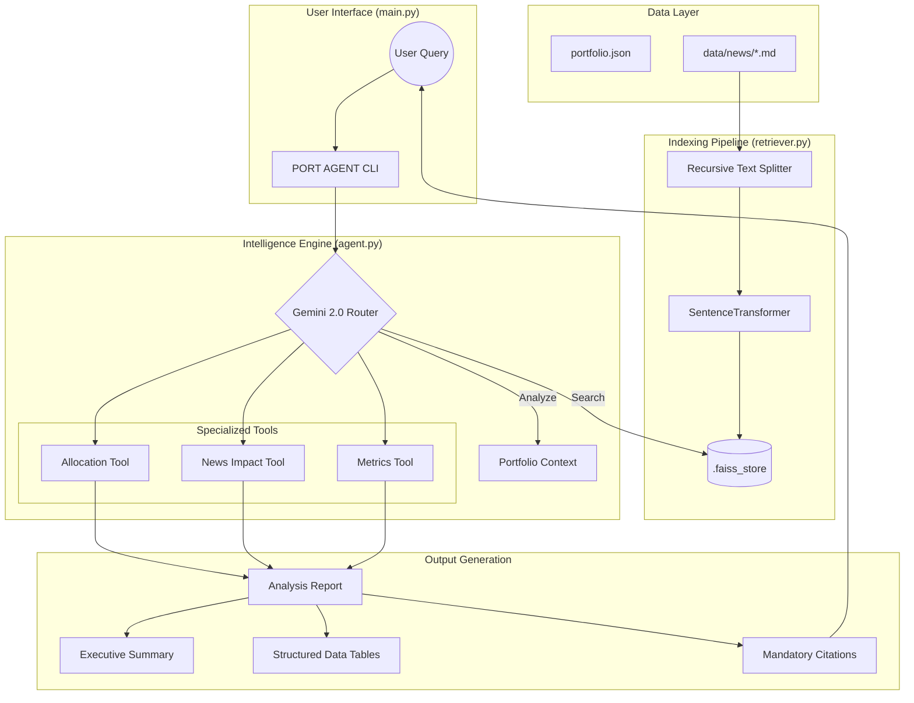

# Ask-Your-Portfolio: Multi-Step Intelligence Agent

**Ask-Your-Portfolio** is a professional, enterprise-grade AI agent designed to provide deep insights into Indian equity portfolios. Built with a focus on accuracy and transparency, it combines **Google Gemini 2.0 Flash** with a robust **RAG (Retrieval-Augmented Generation)** pipeline to analyze market news and portfolio data.

---

## 🧠 System Architecture



---

## 🚀 Key Features

*   **Multi-Step Reasoning**: Powered by Gemini 2.0, the agent orchestrates multiple tools to answer complex queries about sector allocation, risk exposure, and performance metrics.
*   **Professional Analysis Reports**: Outputs are rendered as high-density "Executive Reports" with structured data tables and expert prose summaries.
*   **Real-time News Impact**: Automatically maps the latest market news to your specific stock tickers (NSE/BSE) to assess portfolio risk.
*   **Disciplined Response Engine**: Strictly adheres to financial grounding constraints—no hallucinations, no guessing.

---

## 🛡️ Operational Constraints (HR-Compliant)

This agent is built with a "Safety First" architecture to ensure it can be used in professional financial environments:

1.  **Strict Grounding**: Every claim must be supported by the provided data. If information is missing, the agent responds with: *"Insufficient data to answer."*
2.  **Mandatory Citations**: All reports include a "Sources" footer listing every document and data point used.
3.  **Numerical Integrity**: Precise calculations are performed for weights and values; no approximations are allowed without a data-driven basis.
4.  **Zero Hallucination**: The agent is programmed to refuse general knowledge questions that are not grounded in the specific portfolio or news context.

---

## 🛠️ Tech Stack

*   **LLM**: Google Gemini 2.0 Flash (via LangChain)
*   **Embeddings**: `sentence-transformers/all-MiniLM-L6-v2` (Bi-Encoder)
*   **Vector Store**: FAISS (IndexFlatL2) for high-performance semantic retrieval
*   **UI/UX**: Rich Library (for advanced CLI rendering, roadmap tracking, and data tables)
*   **Framework**: LangChain (ReAct Agent architecture)
*   **CLI**: Typer

---

## 📁 Project Structure

```text
├── portfolio_ask/          # Core source code
│   ├── agent.py            # LangChain ReAct agent & tool definitions
│   ├── retriever.py        # FAISS vector store & embedding logic
│   ├── models.py           # Pydantic models for structured output
│   └── __main__.py         # Rich CLI & REPL loop
├── data/
│   ├── portfolio.json      # Your equity holdings (Ground Truth)
│   └── news/               # Market news documents (.md / .txt)
├── docs/                   # System architecture and visual assets
├── AI_LOG.md               # Detailed development & negotiation log
└── pyproject.toml          # Dependencies & project metadata
```

---

## ⚙️ Installation & Usage

1.  **Clone & Install**:
    ```bash
    git clone https://github.com/your-username/ask-your-portfolio.git
    cd ask-your-portfolio
    # Recommended: use 'uv' for fast installation
    uv venv && source .venv/bin/activate
    uv pip install -e .
    ```

2.  **Environment Setup**:
    Create a `.env` file from the example:
    ```bash
    cp .env.example .env
    # Add your GOOGLE_API_KEY from Google AI Studio
    ```

3.  **Run the Agent**:
    ```bash
    make start
    # or
    python -m portfolio_ask
    ```

---

## 📋 Sample Queries

*   *"How does the latest news affect my HDFCBANK holdings?"*
*   *"What is my current allocation to the Information Technology sector?"*
*   *"Compare the performance of TCS and INFOSYS."*
*   *"Give me a summary of the latest news for the Telecom sector."*

---

*Developed by Vinodhan | 2026*
