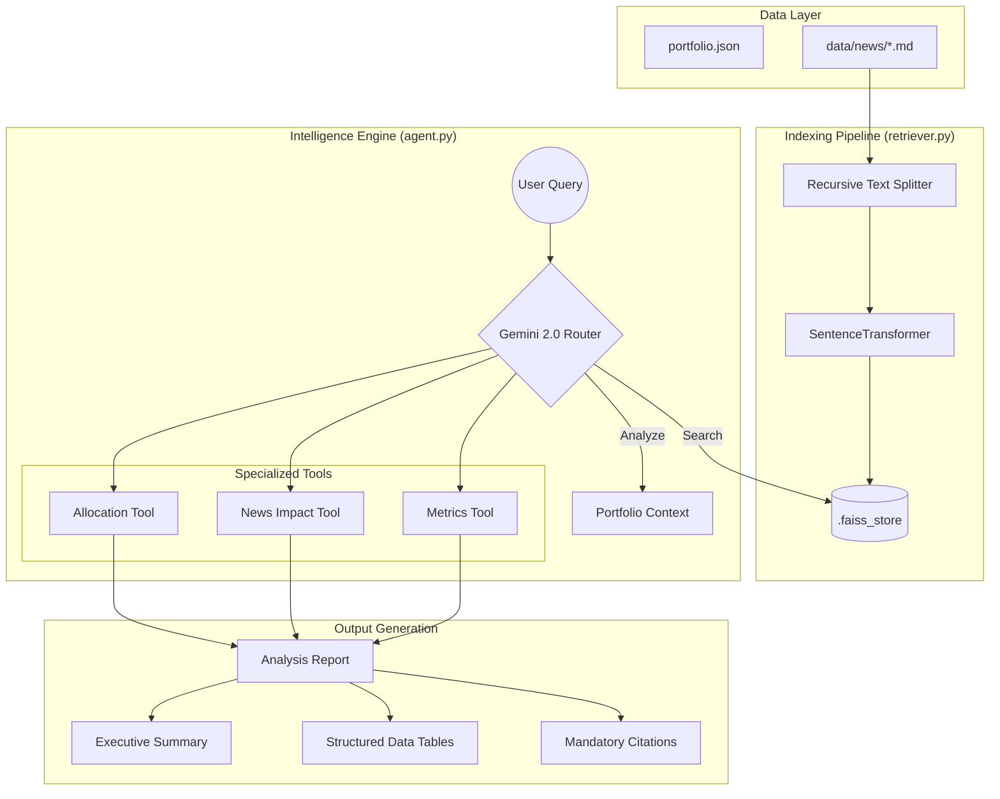

# 🛡️ PORT AGENT: Multi-Step Portfolio Intelligence
[](https://www.python.org/downloads/)
[](https://python.langchain.com/docs/modules/agents/agent_types/react)
[](https://ai.google.dev/)
[](https://github.com/facebookresearch/faiss)

**PORT AGENT** is an enterprise-grade AI financial analyst designed for Indian equity portfolios. It leverages **Google Gemini 2.0 Flash** and a high-performance **RAG (Retrieval-Augmented Generation)** pipeline to provide grounded, traceable insights into market news, sector exposure, and portfolio performance.

---

## 🧠 System Architecture

The system uses a multi-step ReAct (Reasoning and Acting) logic to orchestrate specialized financial tools.


> [!TIP]
> Detailed architecture diagrams and logic flow charts are available in the [docs/](./docs) directory.

---

## 🚀 Key Capabilities

*   **Multi-Step Reasoning**: Orchestrates multiple tools in sequence to solve complex analytical queries.
*   **Executive Analysis Reports**: Generates high-density reports with structured tables and expert narrative summaries.
*   **Sector & Asset Mapping**: Automatically resolves market news to specific holdings (NSE/BSE tickers).
*   **Enterprise-Grade Grounding**: Strictly follows "Safety First" constraints to eliminate hallucinations.

---

## 🛡️ Operational Guardrails (HR/Compliance Ready)

Designed for accuracy and traceability, the agent follows strict operational constraints:

| Constraint | Implementation |
| :--- | :--- |
| **Grounding** | Statements are valid only if backed by `data/` context. |
| **Traceability** | Mandatory `sources` footer for every numerical claim. |
| **Failure Mode** | Returns *"Insufficient data to answer"* for out-of-context queries. |
| **Consistency** | Natural language summaries are cross-validated against structured data. |

---

## 🛠️ Installation & Setup

### 1. Prerequisites
*   Python 3.11 or higher
*   [uv](https://github.com/astral-sh/uv) (recommended for fast dependency management)

### 2. Environment Configuration
Create a `.env` file in the root directory:
```bash
# Mandatory: Get your key from https://aistudio.google.com/
GOOGLE_API_KEY=your_gemini_api_key

# Optional: Recommended to avoid Hugging Face rate limits
HF_TOKEN=your_hugging_face_token
```

### 3. Quick Start
```bash
# Install dependencies and start the CLI
make start

# Or manually
uv pip install -e .
python -m portfolio_ask
```

---

## 📋 Command Reference

| Command | Action |
| :--- | :--- |
| `/portfolio` | Display full asset holdings table with real-time P&L. |
| `/rebuild` | Force-rebuild the FAISS vector index from `data/news/`. |
| `/help` | Show all available slash commands and system info. |
| `/json` | Toggle raw JSON output mode for technical inspection. |
| `/quit` | Perform a professional graceful system shutdown. |

---

## 📖 Documentation
*   [AI_LOG.md](./AI_LOG.md): The human story of how this agent was built and negotiated.
*   [docs/architecture.png](./docs/architecture.png): High-fidelity system design visualization.
*   [docs/flow_diagram.md](./docs/flow_diagram.md): Granular step-by-step logic flow of the agent nodes.

---
*Developed with focus on Technical Integrity and Financial Accuracy | 2026*
